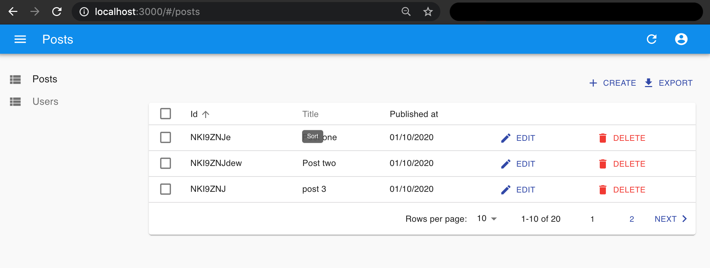
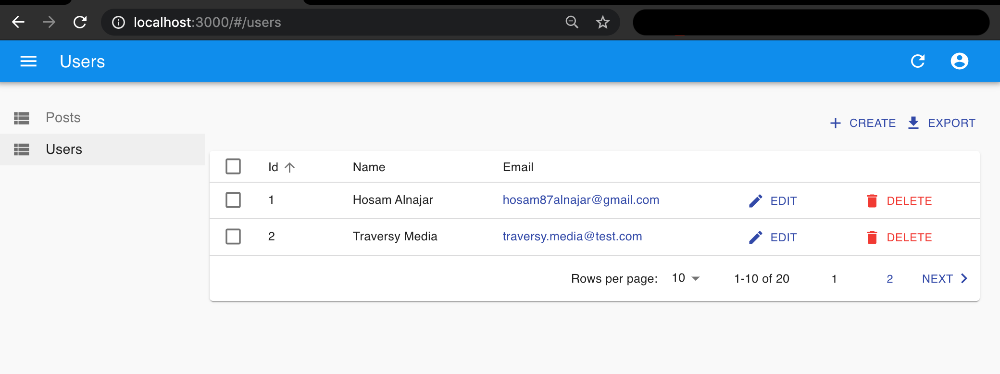
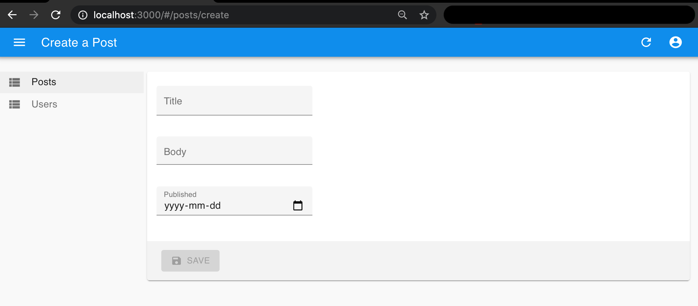
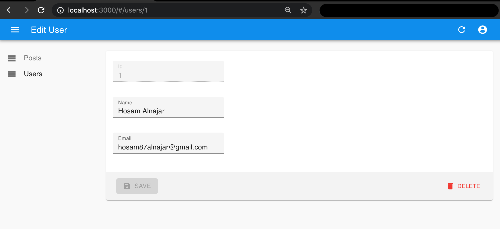

## React Admin Template

React Complete project. <br>

## Features
#### Posts List Component

#### Users List Component

#### Create New Post Component

#### Edit User Component


## Run Locally

### 1. Clone repo

```
$ git clone https://github.com/HosamAlnajar/React-Admin-Template.git
$ cd React-Admin-Template
```

### 3. Run Backend

```
$ npm install
$ npm run dev
```

## Notice
This project was written depending on a video on Traversy Media youtube.
- [Traversy Media](https://www.youtube.com/watch?v=HRmdj-HpJyE&ab_channel=TraversyMedia): Traversy Media features the best online web development and programming tutorials for all of the latest web technologies including Node.js, Angular 2, React.js, PHP, Rails, HTML, CSS and much more


